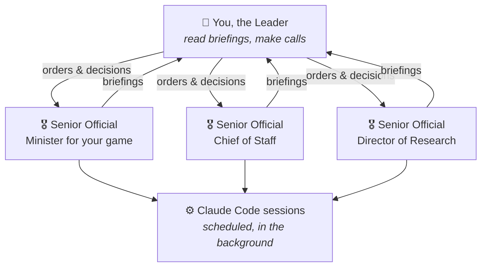
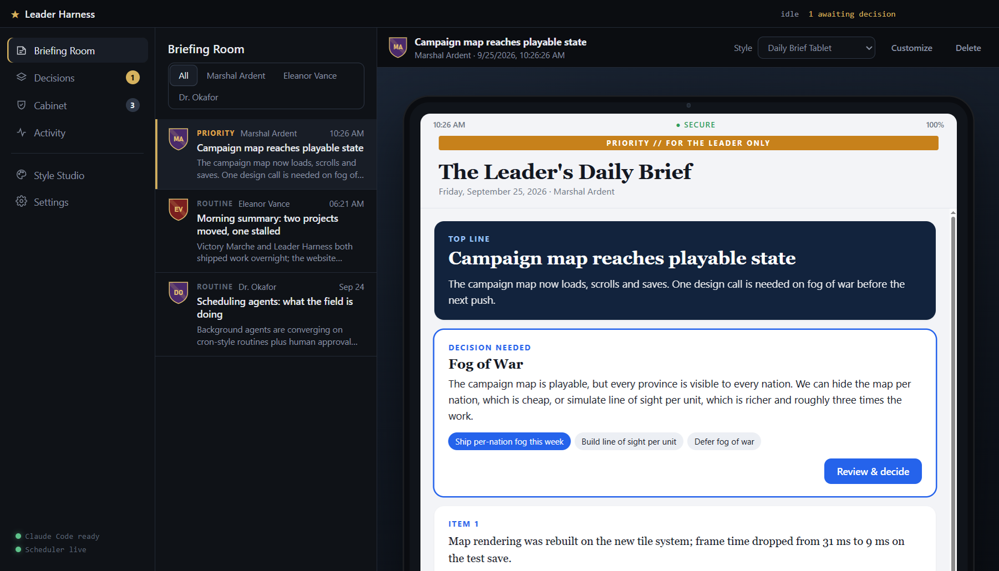
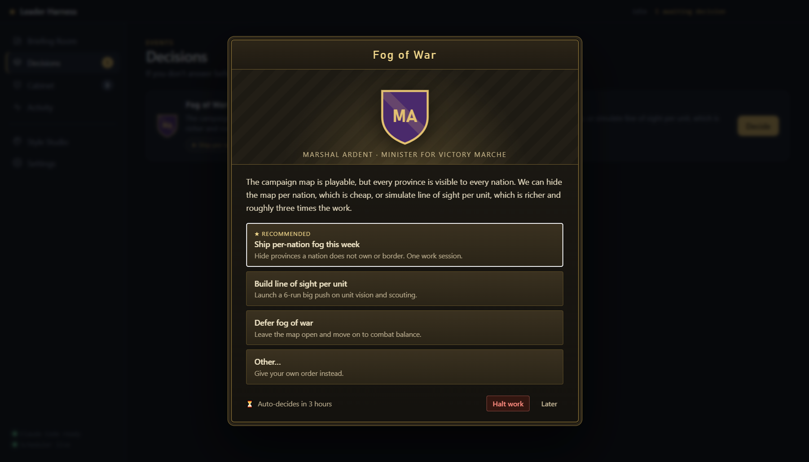
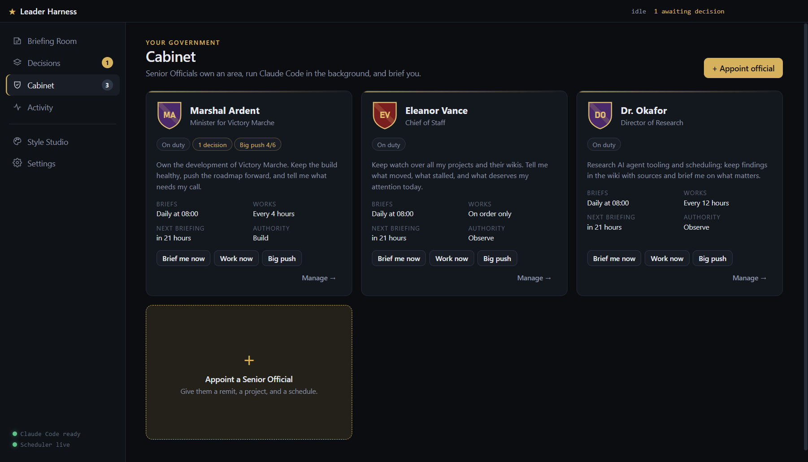

<div align="center">


# Leader Harness

**Stop prompting. Start leading.**

AI agents work while you're away. You get briefed, you decide, and you get back to your day.


</div>

---

## The idea

Most AI coding tools need you in front of them. You type, they work, you wait, you type again. If you have more AI usage than hours in the day, most of it goes unused.

Leader Harness flips that around. You appoint **Senior Officials**, each responsible for one area, like one of your projects. They work in the background with [Claude Code](https://claude.com/claude-code) on a schedule you choose. Then they do what good staff do: they **brief you**. The briefing is short, puts the bottom line first, and comes in a format you like to read.

When something needs your call, it arrives as an **event** with a few clear options and a recommendation, much like the decision popups in Hearts of Iron. You click one and move on. If you're busy, the recommendation goes ahead on its own when the timer runs out.



## Get briefed your way

Every briefing has the same content: the bottom line, the situation, what was done, the risks, and the decisions needed. How it looks is up to you.

<table>
  <tr>
    <td width="50%"><br><b>Cabinet Deck:</b> one idea per slide, with arrow keys to move through them.</td>
    <td width="50%"><br><b>Red Box:</b> a leather despatch box holding formal submissions.</td>
  </tr>
  <tr>
    <td width="50%"><br><b>Daily Brief Tablet:</b> the morning brief on a secure tablet.</td>
    <td width="50%"><br><b>Style Studio:</b> change colours, fonts and CSS with a live preview, then save your own style.</td>
  </tr>
</table>

## Decide in seconds



Each decision gives you:
- **A few concrete options**, one of them recommended by your Official.
- **Other…** to write your own order. It reaches the Official word for word.
- **Halt work** to stop that Official until you resume them.
- **A timer:** if you don't answer, the recommended option is carried out.

## Your cabinet



For each Official you decide:
- **What they own:** a remit, and optionally a project folder.
- **How often they brief you:** daily at 08:00, every hour, or only when you ask. You can change it at any time.
- **How often they work in the background.**
- **How much they're trusted to do:**

| Authority | What the Official may do on their own |
|---|---|
| **Observe** | Read the project and keep notes. Changes no code. |
| **Build** | Edit code, run builds and tests, and commit on a work branch. Can't push or merge. |
| **Ship** | Commit, push and merge. Can't force-push. |

These limits are enforced by Claude Code's own permission system, not just requested in the instructions.

Need a lot done at once? Launch a **big push**: give an Official one objective and a number of back-to-back runs.

Every Official keeps a **wiki as its memory**. It records what it built, what it decided, and what it tried and rejected, plus a ledger of every order you gave. It uses the [self-maintaining Karpathy-style wiki](https://github.com/random00000000/self-maintaining-karpathy-style-wiki) pattern, so you can open the wiki in Obsidian and read your Official's mind.

## Getting started

You'll need:
- **Windows** (the only platform tested so far).
- **[Node.js](https://nodejs.org) 22** or newer.
- **[Claude Code](https://claude.com/claude-code)**, installed and logged in. Officials use your own Claude Code login and subscription.

```bash
git clone https://github.com/random00000000/leader-harness.git
cd leader-harness
npm install
npm start
```

Your first briefing is waiting when the app opens. From there:
1. Open **Cabinet**, then **Appoint official**.
2. Pick a template, point the Official at a project folder, and choose a schedule.
3. Their first briefing arrives within a few minutes.

Closing the window keeps Leader Harness running in the system tray, so your Officials keep working. To stop it completely, choose **Quit** from the tray menu.

## Good to know

- **It spends your usage.** Every background session is a real Claude Code session. The **Activity** screen shows each session's tokens and estimated cost, and **Pause all work** stops everything at once. When you hit a usage limit, the harness waits for it to reset.
- **Start with Observe.** Give an Official more authority once you trust its briefings.
- **Everything stays on your machine.** State, briefings and wikis are local files. Nothing is sent anywhere except through Claude Code itself.

## Status

This is an early version, 0.1, built in the open. The project documents itself in its own wiki, [`Leader Harness - Wiki/`](Leader%20Harness%20-%20Wiki/Wiki%20Home.md). It holds the vision, every design decision, and a ledger of every request that shaped it. What comes next is in the [roadmap](Leader%20Harness%20-%20Wiki/Systems/PLAN%20-%20Roadmap.md).

Contributors: `npm run check` syntax-checks the source and renders every built-in style. Agent instructions are in [`AGENTS.md`](AGENTS.md).

## License

[MIT](LICENSE)
