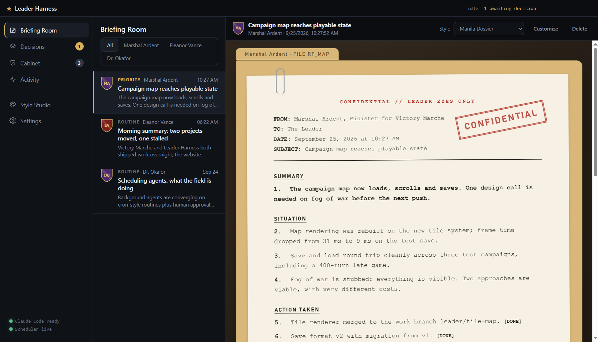
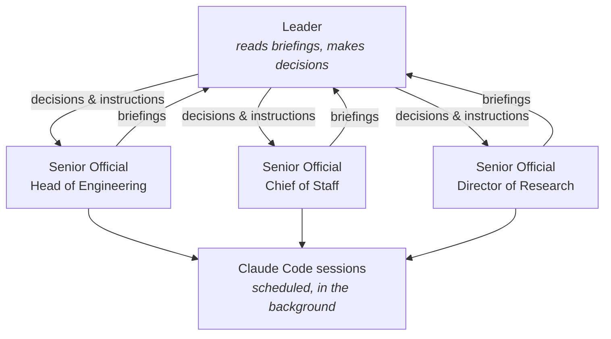
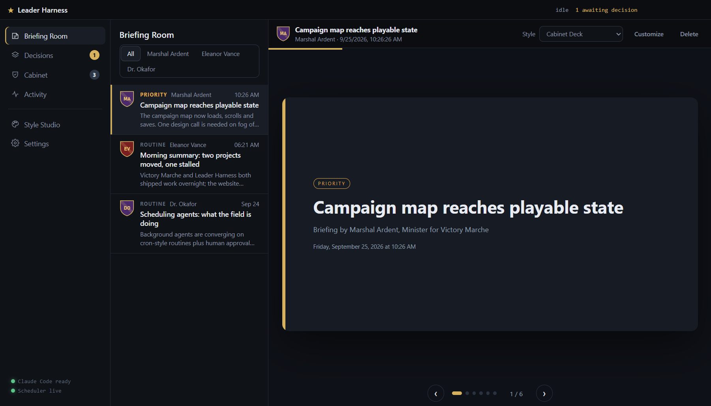
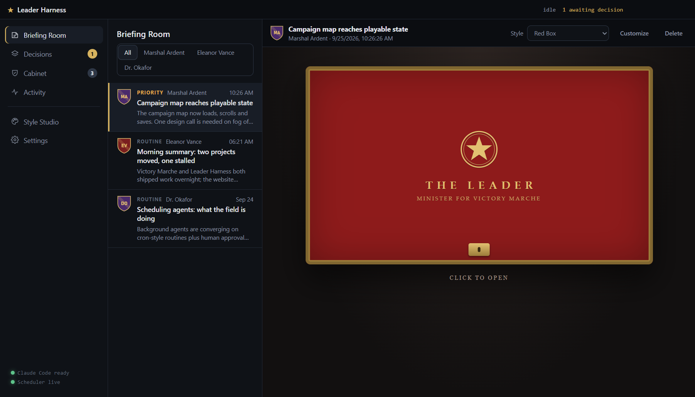
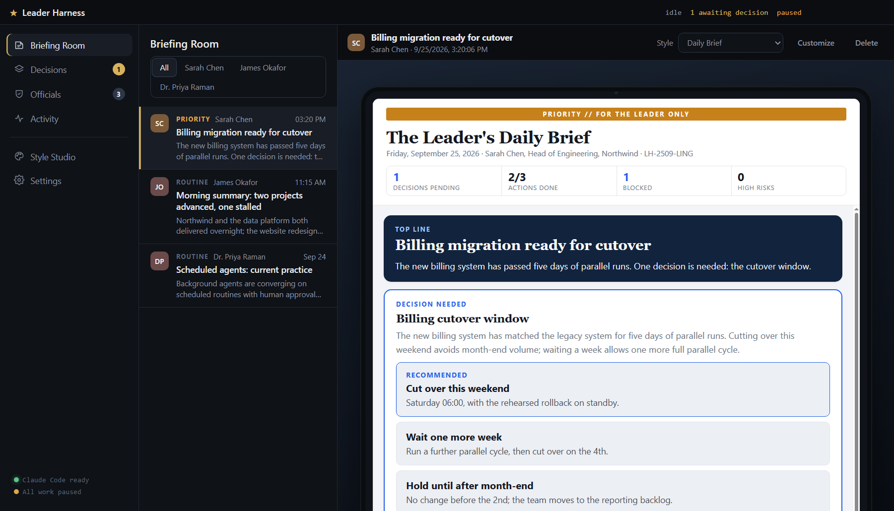
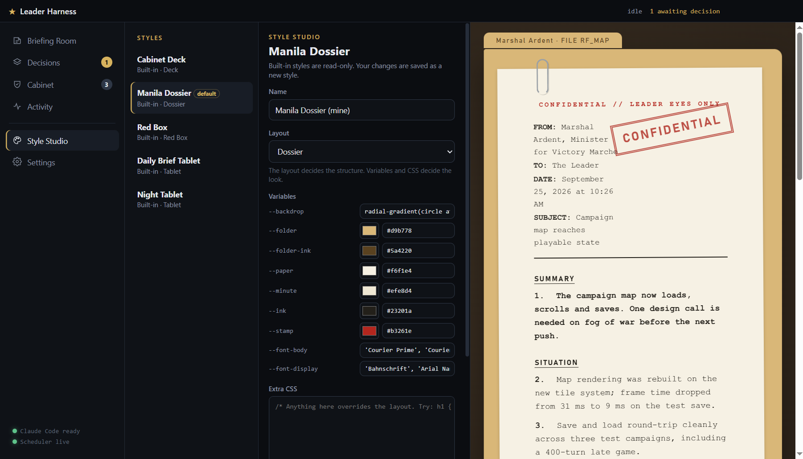
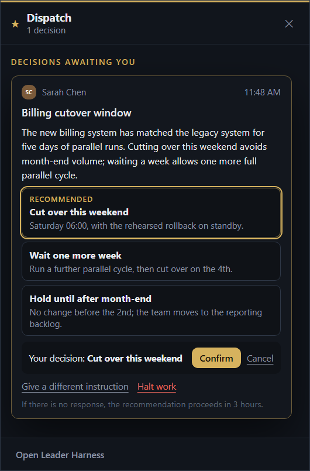
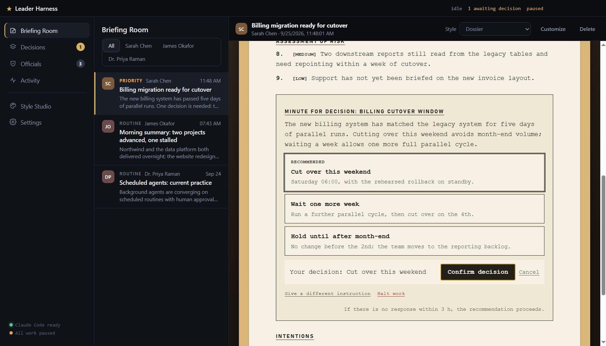
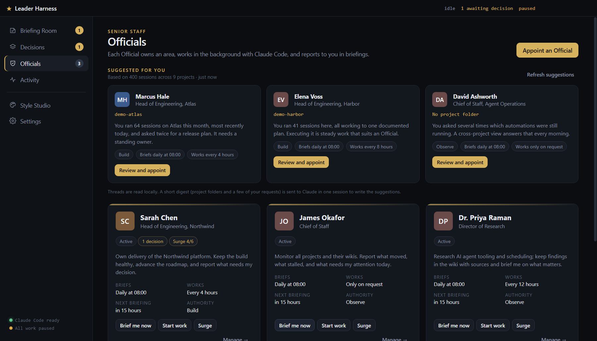

<div align="center">


# Leader Harness

**Briefings, not prompts.**

AI agents that work while you are away and report to you like a well-run staff.



</div>

---

## Why it exists

AI coding and research agents are capable, but they assume someone is at the keyboard: you write a prompt, wait, review, and prompt again. Executives and founders rarely have that time. Their AI subscriptions go unused while the work waits.

Leader Harness works the way an executive office or intelligence service does. You appoint **Senior Officials**, each responsible for one area. They work in the background with [Claude Code](https://claude.com/claude-code) on a schedule you set. They report through **briefings**: short, with the bottom line first, and in the format you prefer. When something needs your judgement, it arrives as a **decision** with clear options and a recommendation. If you don't respond in time, the recommendation proceeds.



## Briefings in the format you read best

Every briefing has the same content, in the same order in every format: the bottom line, the decisions needed, the situation, actions and risks as short tables, and what comes next. An at-a-glance strip at the top counts pending decisions, actions done, blocked items and high risks. You choose how it's presented.

<table>
  <tr>
    <td width="50%"><br><b>Slide Deck:</b> one point per slide, with the numbers on the cover.</td>
    <td width="50%"><br><b>Red Box:</b> a despatch box holding a Whitehall-style submission.</td>
  </tr>
  <tr>
    <td width="50%"><br><b>Daily Brief:</b> the brief as read on a secure tablet.</td>
    <td width="50%"><br><b>Style Studio:</b> adjust any format, or build your own, with a live preview.</td>
  </tr>
</table>

## Briefings come to you

When an Official reports, the **Dispatch** panel appears quietly in the corner of your screen. It shows the bottom line of each new briefing and every decision waiting for you, so you can answer without opening the harness. Click the tray icon to bring it back at any time.



## Decisions that take seconds

Decide wherever you are reading: in Dispatch, or inside the briefing itself, in any format.



Each decision states the situation and gives you:
- **A few concrete options**, one of them recommended by the Official. Pick one, then confirm.
- **Give a different instruction**, if none of the options fits. The Official receives your words exactly as written.
- **Halt work**, to stop that Official until you resume them.
- **A response window.** If there's no response in time, the recommendation proceeds.

## Your Officials

Not sure whom to appoint? The Officials screen reads your recent Claude Code and Codex threads on this computer and **suggests three Officials** for the work you do most, each with a project, a remit and a reason. One click opens the appointment, already filled in.



For each Official you set:
- **A remit,** and optionally a project folder.
- **A reporting schedule,** such as daily at 08:00, hourly, or only on request. You can change it at any time.
- **How often they work in the background.**
- **An authority level:**

| Authority | What the Official may do without asking |
|---|---|
| **Observe** | Read the project and keep its records. No code changes. |
| **Build** | Edit code, run builds and tests, and commit on a work branch. No push or merge. |
| **Ship** | Commit, push and merge. No force-push. |

Authority is enforced through Claude Code's own permission system, not merely requested in the instructions.

To concentrate effort on one objective, start a **surge**: a set number of back-to-back work sessions that each continue where the previous one stopped.

Each Official keeps a **wiki as its working memory**. It records what was built, what was decided and why, and what was tried and rejected, plus a ledger of every instruction you gave. It follows the [self-maintaining Karpathy-style wiki](https://github.com/random00000000/self-maintaining-karpathy-style-wiki) pattern, so you can open it in Obsidian and review an Official's reasoning at any time.

## Getting started

Requirements:
- **Windows.** This is the only platform tested so far.
- **[Node.js](https://nodejs.org) 22** or later.
- **[Claude Code](https://claude.com/claude-code)**, installed and signed in. Officials use your own Claude Code login and subscription.

```bash
git clone https://github.com/random00000000/leader-harness.git
cd leader-harness
npm install
npm run release
```

`npm run release` builds a tested, versioned copy of the app and puts a **Leader Harness** shortcut in the repo folder. Open it from there. `npm run rollback` returns to the previous version if a release ever misbehaves. (`npm start` runs the development version from source.)

A short setup briefing is waiting when the app opens. Then:
1. Open **Officials** and choose **Appoint an Official**.
2. Pick a template, point the Official at a project folder, and set a reporting schedule.
3. The first briefing arrives within a few minutes.

## Light on your machine

Leader Harness is designed to stay out of your way:
- **Closing the window frees it completely.** Only a small background process stays in the system tray to keep the schedule, using about 175 MB of memory and no measurable CPU when idle.
- **Officials' sessions run at below-normal priority,** so your own work always comes first.
- **One session at a time** by default. Settings let you allow more.
- **Pause all work** stops everything at once. The Activity screen shows what each session used.

## Good to know

- **It uses your subscription.** Every background session is a real Claude Code session. If you reach a usage limit, the harness waits for it to reset.
- **Start with Observe.** Raise an Official's authority once their briefings have earned your trust.
- **Your data stays local.** State, briefings and wikis are files on your machine. Nothing leaves it except through Claude Code itself.

## Status

Version 0.1, developed in the open. The project documents itself in its own wiki, [`Leader Harness - Wiki/`](Leader%20Harness%20-%20Wiki/Wiki%20Home.md), which holds the design decisions and a ledger of every request that shaped them. Planned work is on the [roadmap](Leader%20Harness%20-%20Wiki/Systems/PLAN%20-%20Roadmap.md).

Contributors: `npm run check` validates the source and renders every built-in format. Agent instructions are in [`AGENTS.md`](AGENTS.md).

## License

[MIT](LICENSE)
